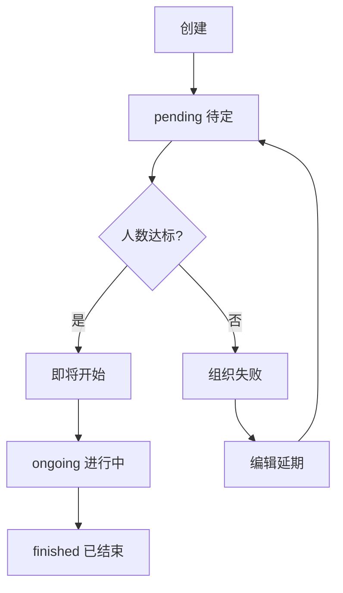
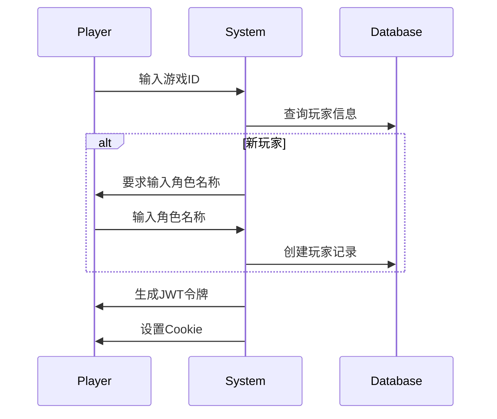
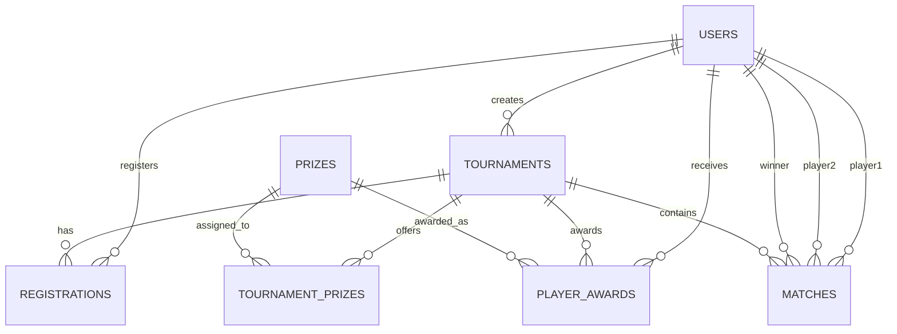

# QWEN.md - 燕云十六声1v1竞技比赛管理平台

> **重要：** 本文档专为Qwen Code AI助手设计，去除所有团队开发冗余内容，专注AI开发效率
>
> **QWEN-CODE 内部操作规范（必须遵守）：**
> 1. **代码提交规范**：使用`git commit -F commit_message.txt`方式提交，提交后必须删除临时文件
> 2. **数据库规范**：使用`path.join(process.cwd(), 'database.db')`构建数据库路径
> 3. **文档更新**：当需求变更时，主动请求更新QWEN.md，发现冲突需用户确认
> 4. **开发流程**：完成开发后等待用户测试结果，确认无误后再继续下一步
> 5. **技术文档**：必要时主动阅读和更新docs目录下的技术文档

---

## 1. 产品定位与愿景

### 1.1 产品使命
构建一个专业、高效、沉浸式的1v1竞技比赛管理平台，为《燕云十六声》玩家提供公平竞技环境，为主播/主办方提供便捷的赛事组织工具。

### 1.2 核心价值主张
- **对主办方**：零门槛创建专业赛事，自动化管理流程，提升直播内容质量
- **对玩家**：一键参赛，实时查看战况，公平竞技体验
- **对观众**：沉浸式观赛体验，国风武侠视觉享受

---

## 2. 技术架构规范

### 2.1 技术栈锁定
| 层级 | 技术 | 版本 | 说明 |
|---|---|---|---|
| 前端框架 | Next.js | 14+ | App Router, TypeScript |
| 样式方案 | Tailwind CSS | 3.4+ | 国风设计系统 |
| 数据库 | SQLite | 3.45+ | 零配置，query函数封装 |
| 认证方案 | JWT (jose) | 最新版 | Cookie存储，中间件保护 |

### 2.2 架构原则
- **模块化设计**：每个功能独立可测试
- **渐进式增强**：核心功能优先，逐步优化
- **性能优先**：首屏<2s，交互<100ms
- **安全至上**：OWASP防护，数据加密

### 2.3 代码组织
```
src/
├── app/           # Next.js App Router
│   ├── api/      # RESTful API端点
│   ├── login/    # 认证页面
│   ├── tournaments/ # 赛事管理
│   └── ...
├── components/   # 可复用组件
├── utils/        # 工具函数
└── types/        # TypeScript定义
```

---

## 3. 用户体验设计规范

### 3.1 国风设计系统
#### 3.1.1 色彩系统（必须严格使用）
```css
/* 主色调 */
--primary-dark: #1A1A1A      /* 深砉灰 - 背景主色 */
--primary-gold: #B89766     /* 暗金 - 强调色 */
--primary-red: #C83C23      /* 朱砂红 - 警示/重要 */
--primary-white: #F5F5F5    /* 象牙白 - 文本主色 */

/* 语义化色彩 */
--success: #22C55E          /* 成功状态 */
--warning: #F59E0B          /* 警告状态 */
--error: #EF4444            /* 错误状态 */
--info: #3B82F6             /* 信息状态 */
```

#### 3.1.2 响应式断点
- 移动端：<768px
- 平板：768px-1024px  
- 桌面：>1024px

### 3.2 交互原则
- **3秒反馈**：任何操作3秒内有响应
- **防错设计**：重要操作二次确认
- **状态可见**：实时更新系统状态

---

## 4. 功能模块详细设计

### 4.1 赛事管理系统
#### 4.1.1 赛事生命周期


#### 4.1.2 赛事配置规范
| 配置项 | 限制 | 默认值 | 关键说明 |
|---|---|---|---|
| 比赛名称 | 2-50字符 | - | 支持emoji |
| 最少人数 | 10-48人 | 16 | <10人无法开赛 |
| 最多人数 | 10-48人 | 32 | 受游戏房间限制 |
| 报名截止 | ≤开始时间 | 开始时间 | 可提前截止 |

#### 4.1.3 智能赛制推荐
```javascript
// 根据人数自动推荐赛制
const getRecommendedFormat = (count) => {
  if (count <= 16) return { rounds: 1, format: '单败淘汰' };
  if (count <= 32) return { rounds: 3, format: '三局两胜' };
  return { rounds: 5, format: '五局三胜' };
};
```

### 4.2 用户认证系统
#### 4.2.1 玩家认证流程


#### 4.2.2 双角色认证
- **玩家**：仅需游戏ID + 角色名称
- **主办方**：账号密码 + 游戏角色绑定

#### 4.2.2 权限矩阵
```
功能          游客  玩家  主办方  管理员
查看比赛      ✓    ✓    ✓      ✓
报名参赛      ✗    ✓    ✓      ✓
创建比赛      ✗    ✗    ✓      ✓
管理比赛      ✗    ✗    自己    全部
```

### 4.3 数据模型核心关系（基于实际数据库）


### 4.3.2 核心表结构
| 表名 | 主要作用 | 关键字段 |
|---|---|---|
| **Users** | 用户管理 | id, username, game_id, character_name, role |
| **Tournaments** | 赛事管理 | id, name, organizer_id, status, start_time |
| **Registrations** | 报名管理 | tournament_id, player_id, character_name, status |
| **Matches** | 比赛记录 | tournament_id, player1_id, player2_id, winner_id |
| **Prizes** | 奖品定义 | id, name, description |
| **TournamentPrizes** | 赛事奖品配置 | tournament_id, prize_id, rank_start, rank_end |
| **PlayerAwards** | 获奖记录 | tournament_id, player_id, prize_id |

---

## 5. 性能与安全规范

### 5.1 性能优化
- **前端**：代码分割、图片优化、缓存策略
- **后端**：索引优化、分页查询、连接池
- **目标**：首屏<2s，API<200ms

### 5.2 安全防护
- **XSS防护**：输入验证，输出转义
- **SQL注入**：参数化查询（已封装）
- **认证安全**：JWT + 密码哈希
- **文件上传**：类型检查，大小限制

---

## 6. 验证与调试

### 6.1 开发验证清单
- [ ] 功能符合需求描述
- [ ] 响应式正常（手机+桌面）
- [ ] 数据库操作正确
- [ ] 错误处理完善

### 6.2 调试工具
```bash
npm run dev      # 开发服务器
npm run build    # 构建检查
npm run lint     # 代码规范
sqlite3 database.db ".tables"  # 数据库查看
```

### 6.3 调试技巧
- **API调试**：浏览器Network面板
- **样式调试**：Elements面板实时调整
- **数据验证**：直接查询数据库确认

---

## 7. 扩展规划（了解即可）

### 7.1 功能扩展方向
- **5v5团队赛**：基于现有架构扩展
- **联赛系统**：周期性赛事管理
- **数据统计**：玩家数据分析
- **社交功能**：关注、私信

### 7.2 技术扩展准备
- **数据库**：SQLite→MySQL平滑迁移
- **缓存**：高并发时引入Redis
- **CDN**：静态资源优化

---

## 附录

### A. 术语表
- **砺兵台**：《燕云十六声》游戏内的1v1竞技场
- **主办方**：创建并管理比赛的用户
- **玩家**：参与比赛的游戏用户
- **UID**：游戏内唯一角色编号（10位数字）
- **燕云十六声**：目标游戏名称

### B. 参考链接
- [Next.js官方文档](https://nextjs.org/docs)
- [Tailwind CSS设计系统](https://tailwindcss.com/docs)
- [Web-Vitals性能指标](https://web.dev/vitals/)

### C. AI开发助手专用指南

#### C.1 开发原则
- **代码复用优先**：搜索并复用现有模式
- **渐进式开发**：先跑通，再优化
- **实时验证**：每步都测试
- **风格一致**：匹配现有代码风格

#### C.2 快速开发技巧
- **模板复用**：复制tournaments相关代码修改
- **色彩变量**：严格使用定义的CSS变量
- **数据库操作**：统一使用src/database.mjs的query函数
- **文件结构**：遵循现有目录组织

#### C.3 常用搜索关键词
```
# 查找类似功能实现
tournament  # 赛事相关
query(      # 数据库操作
useState    # React状态管理
B89766      # 国风色彩使用
```

**记住：先让功能跑起来，再考虑优化！**