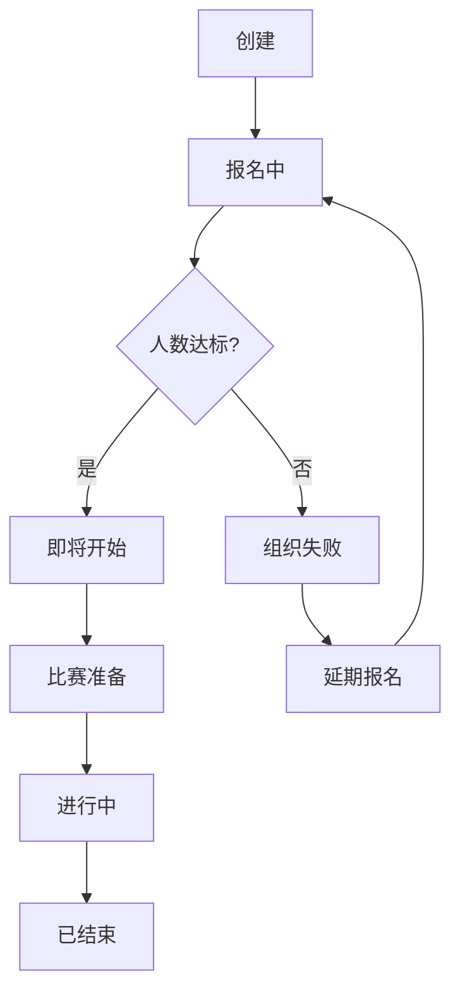
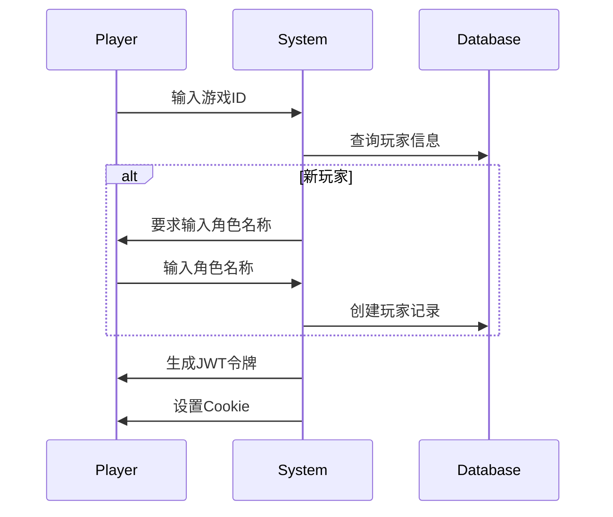
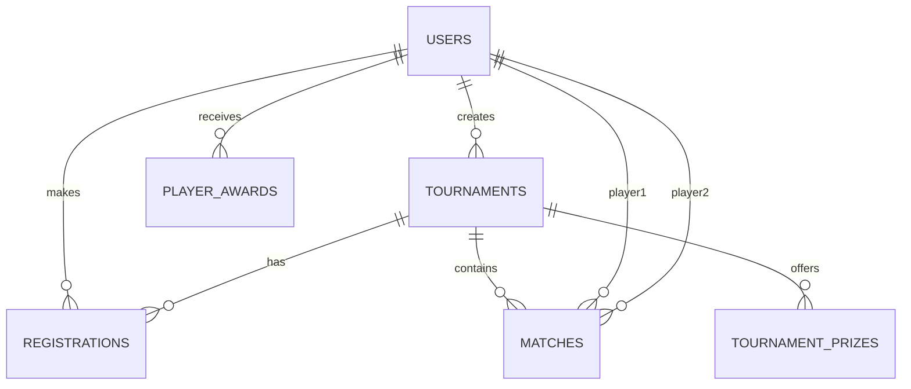

# QWEN.md - 燕云十六声1v1竞技比赛管理平台

**文档类型：** 产品开发技术规范文档  
**版本：** 2.0.0  
**最后更新：** 2025年7月25日  
**作者：** Qwen Code  

---

## 1. 产品定位与愿景

### 1.1 产品使命
构建一个专业、高效、沉浸式的1v1竞技比赛管理平台，为《燕云十六声》玩家提供公平竞技环境，为主播/主办方提供便捷的赛事组织工具。

### 1.2 核心价值主张
- **对主办方**：零门槛创建专业赛事，自动化管理流程，提升直播内容质量
- **对玩家**：一键参赛，实时查看战况，公平竞技体验
- **对观众**：沉浸式观赛体验，国风武侠视觉享受

### 1.3 产品差异化优势
- 深度集成《燕云十六声》游戏生态
- 国风武侠沉浸式视觉设计
- 智能化赛事管理流程
- 主播-玩家-观众三方共赢生态

---

## 2. 技术架构规范

### 2.1 技术栈选型
| 层级 | 技术 | 版本 | 选型理由 |
|---|---|---|---|
| 前端框架 | Next.js | 14+ | SSR/SSG优化SEO，App Router现代化 |
| 语言 | TypeScript | 5.0+ | 类型安全，开发效率 |
| 样式 | Tailwind CSS | 3.4+ | 原子化CSS，设计系统一致性 |
| 数据库 | SQLite | 3.45+ | 轻量级，零配置，适合初创项目 |
| 认证 | JWT (jose) | 最新版 | 无状态认证，前后端分离 |
| 部署 | Vercel/自托管 | - | 灵活部署方案 |

### 2.2 架构原则
- **模块化设计**：每个功能模块独立可测试
- **渐进式增强**：核心功能优先，逐步扩展
- **性能优先**：首屏加载<2s，交互响应<100ms
- **安全至上**：OWASP Top 10防护，数据加密存储

### 2.3 代码组织规范
```
src/
├── app/                    # Next.js App Router
│   ├── api/               # RESTful API端点
│   ├── (auth)/            # 认证相关页面
│   ├── tournaments/       # 赛事管理
│   └── ...
├── components/            # 可复用组件
│   ├── ui/               # 基础UI组件
│   ├── forms/            # 表单组件
│   └── charts/           # 数据可视化
├── lib/                  # 业务逻辑层
│   ├── auth/             # 认证逻辑
│   ├── tournaments/      # 赛事核心逻辑
│   └── utils/            # 工具函数
└── types/                # TypeScript类型定义
```

---

## 3. 用户体验设计规范

### 3.1 设计系统
#### 3.1.1 色彩系统
```css
/* 主色调 */
--primary-dark: #1A1A1A;      /* 深砉灰 - 背景主色 */
--primary-gold: #B89766;     /* 暗金 - 强调色 */
--primary-red: #C83C23;      /* 朱砂红 - 警示/重要 */
--primary-white: #F5F5F5;    /* 象牙白 - 文本主色 */

/* 语义化色彩 */
--success: #22C55E;          /* 成功状态 */
--warning: #F59E0B;          /* 警告状态 */
--error: #EF4444;            /* 错误状态 */
--info: #3B82F6;             /* 信息状态 */
```

#### 3.1.2 字体系统
- **主字体**：Noto Sans SC（简体中文）
- **标题字体**：方正兰亭黑
- **字号规范**：
  - 标题：32px/28px/24px
  - 正文：16px
  - 辅助：14px/12px

#### 3.1.3 间距系统
基于8px网格系统：8px、16px、24px、32px、48px、64px

### 3.2 响应式设计
- **断点设置**：
  - 移动端：<768px
  - 平板：768px-1024px
  - 桌面：>1024px
- **移动端优先**：所有组件默认移动端样式
- **渐进增强**：根据屏幕尺寸增加功能和内容

### 3.3 交互设计原则
- **3秒原则**：任何操作3秒内必须有反馈
- **防错设计**：重要操作二次确认
- **状态可见**：系统状态实时更新
- **错误恢复**：提供明确的错误恢复路径

---

## 4. 功能模块详细设计

### 4.1 赛事管理系统

#### 4.1.1 赛事生命周期


#### 4.1.2 赛事配置规范
| 配置项 | 类型 | 限制 | 默认值 | 说明 |
|---|---|---|---|---|
| 比赛名称 | string | 2-50字符 | - | 支持emoji |
| 开始时间 | datetime | 必须晚于当前时间 | +2小时 | 精确到分钟 |
| 最少人数 | int | 10-48 | 16 | 低于10人无法开赛 |
| 最多人数 | int | 10-48 | 32 | 受游戏房间限制 |
| 报名截止 | datetime | ≤开始时间 | 开始时间 | 可提前截止 |
| 赛事说明 | text | 0-1000字符 | 模板文本 | Markdown支持 |

#### 4.1.3 智能赛制推荐
```javascript
const getRecommendedFormat = (playerCount) => {
  if (playerCount <= 16) return { rounds: 1, format: '单败淘汰' };
  if (playerCount <= 32) return { rounds: 3, format: '三局两胜' };
  return { rounds: 5, format: '五局三胜' };
};
```

### 4.2 用户认证系统

#### 4.2.1 玩家认证流程


#### 4.2.2 主办方认证增强
- **双因子认证**：密码 + 手机验证码
- **实名认证**：绑定游戏角色验证
- **权限分级**：创建者、管理员、观察者

### 4.3 数据模型设计

#### 4.3.1 核心实体关系


#### 4.3.2 关键字段规范
- **ID生成**：UUID v4，确保全局唯一
- **时间存储**：UTC时间，前端本地化显示
- **枚举值**：使用数据库存储，避免魔法字符串
- **软删除**：deleted_at字段标记删除

### 4.4 奖品管理系统

#### 4.4.1 奖品类型定义
```typescript
interface Prize {
  id: string;
  name: string;
  type: 'PHYSICAL' | 'VIRTUAL' | 'CERTIFICATE' | 'NONE';
  description: string;
  imageUrl?: string;
  quantity: number;
  sponsor?: string;
}
```

#### 4.4.2 奖品发放规则
- **自动发放**：比赛结束后24小时内
- **手动确认**：高价值奖品需玩家确认收货
- **弃赛处理**：弃赛玩家不参与奖品分配
- **并列排名**：奖品数量不足时平均分配

---

## 5. 性能优化规范

### 5.1 前端性能
- **代码分割**：按路由和组件懒加载
- **图片优化**：WebP格式，响应式图片
- **缓存策略**：静态资源1年缓存，API数据按需缓存
- **CDN加速**：静态资源使用CDN分发

### 5.2 后端性能
- **数据库优化**：
  - 索引策略：高频查询字段建立索引
  - 查询优化：避免N+1查询问题
  - 连接池：SQLite连接池管理
- **API优化**：
  - 分页查询：默认20条，最大100条
  - 字段过滤：支持GraphQL风格查询
  - 压缩响应：Gzip压缩API响应

### 5.3 监控指标
| 指标 | 目标值 | 监控方式 |
|---|---|---|
| 首屏加载时间 | <2s | Web-Vitals |
| API响应时间 | <200ms | 后端日志 |
| 错误率 | <1% | Sentry监控 |
| 可用性 | 99.9% | 健康检查 |

---

## 6. 安全规范

### 6.1 数据安全
- **敏感信息加密**：手机号、邮箱等PII数据AES加密
- **密码安全**：bcrypt哈希，盐值随机生成
- **JWT安全**：RS256算法，密钥轮换机制
- **文件上传**：类型检查，大小限制，病毒扫描

### 6.2 访问控制
- **权限矩阵**：
  ```
  功能          游客    玩家    主办方    管理员
  查看比赛      ✓      ✓      ✓        ✓
  报名参赛      ✗      ✓      ✓        ✓
  创建比赛      ✗      ✗      ✓        ✓
  管理比赛      ✗      ✗      自己     全部
  ```

### 6.3 安全防护
- **XSS防护**：输入验证，输出转义
- **CSRF防护**：双重Cookie验证
- **SQL注入**：参数化查询，ORM使用
- **暴力破解**：登录频率限制，验证码机制

---

## 7. 测试策略

### 7.1 测试金字塔
- **单元测试**：业务逻辑函数，覆盖率>80%
- **集成测试**：API端点，关键用户流程
- **E2E测试**：完整用户旅程，关键路径覆盖
- **性能测试**：负载测试，压力测试

### 7.2 测试数据管理
- **测试数据库**：独立SQLite数据库
- **数据工厂**：使用faker.js生成测试数据
- **快照测试**：UI组件视觉回归测试

### 7.3 测试环境
- **开发环境**：本地开发，热重载
- **测试环境**：Vercel Preview Deployments
- **预生产环境**：生产数据子集
- **生产环境**：蓝绿部署，零停机更新

---

## 8. 部署与运维

### 8.1 部署策略
- **CI/CD流程**：
  ```
  代码提交 → 自动化测试 → 构建 → 部署预览 → 人工审核 → 生产部署
  ```
- **回滚机制**：保留最近5个版本，支持一键回滚
- **数据库迁移**：版本化迁移脚本，自动执行

### 8.2 监控告警
- **应用监控**：Next.js Analytics, Vercel Insights
- **错误追踪**：Sentry集成，实时错误通知
- **性能监控**：Web-Vitals, Core Web Vitals
- **业务监控**：关键指标仪表盘

### 8.3 备份策略
- **数据库备份**：每日自动备份，保留30天
- **文件备份**：上传文件同步到云存储
- **灾难恢复**：RTO<1小时，RPO<5分钟

---

## 9. 开发工作流

### 9.1 分支策略
- **main**：生产分支，保护分支
- **develop**：开发分支，集成测试
- **feature/**：功能分支，单人开发
- **hotfix/**：紧急修复分支

### 9.2 代码审查
- **PR模板**：标准化PR描述
- **代码规范**：ESLint + Prettier自动检查
- **安全检查**：依赖漏洞扫描
- **性能检查**：Lighthouse CI

### 9.3 发布流程
1. **功能开发**：feature分支开发
2. **代码审查**：创建PR，至少1人审查
3. **测试验证**：自动化测试+人工测试
4. **合并发布**：合并到main，自动部署
5. **监控验证**：发布后30分钟监控

---

## 10. 扩展性设计

### 10.1 功能扩展路线图
- **Phase 1**：基础1v1赛事（当前）
- **Phase 2**：5v5团队赛支持
- **Phase 3**：联赛系统
- **Phase 4**：电竞生态平台

### 10.2 技术扩展点
- **微服务架构**：用户服务、赛事服务、奖品服务
- **数据库扩展**：支持MySQL/PostgreSQL
- **缓存层**：Redis缓存热点数据
- **消息队列**：异步处理奖品发放

### 10.3 第三方集成
- **支付系统**：支付宝、微信支付
- **直播平台**：斗鱼、虎牙、B站直播
- **游戏API**：官方战绩查询
- **社交媒体**：微信、QQ一键分享

---

## 附录

### A. 术语表
- **砺兵台**：《燕云十六声》游戏内的1v1竞技场
- **主办方**：创建并管理比赛的用户
- **玩家**：参与比赛的游戏用户
- **UID**：游戏内唯一角色编号

### B. 参考链接
- [Next.js官方文档](https://nextjs.org/docs)
- [Tailwind CSS设计系统](https://tailwindcss.com/docs)
- [Web-Vitals性能指标](https://web.dev/vitals/)

### C. 更新日志
- **v2.0.0** (2025-07-25): 首次QWEN.md版本发布
- **v1.0.0** (2025-07-24): 基于GEMINI.md和CLAUDE.md整合